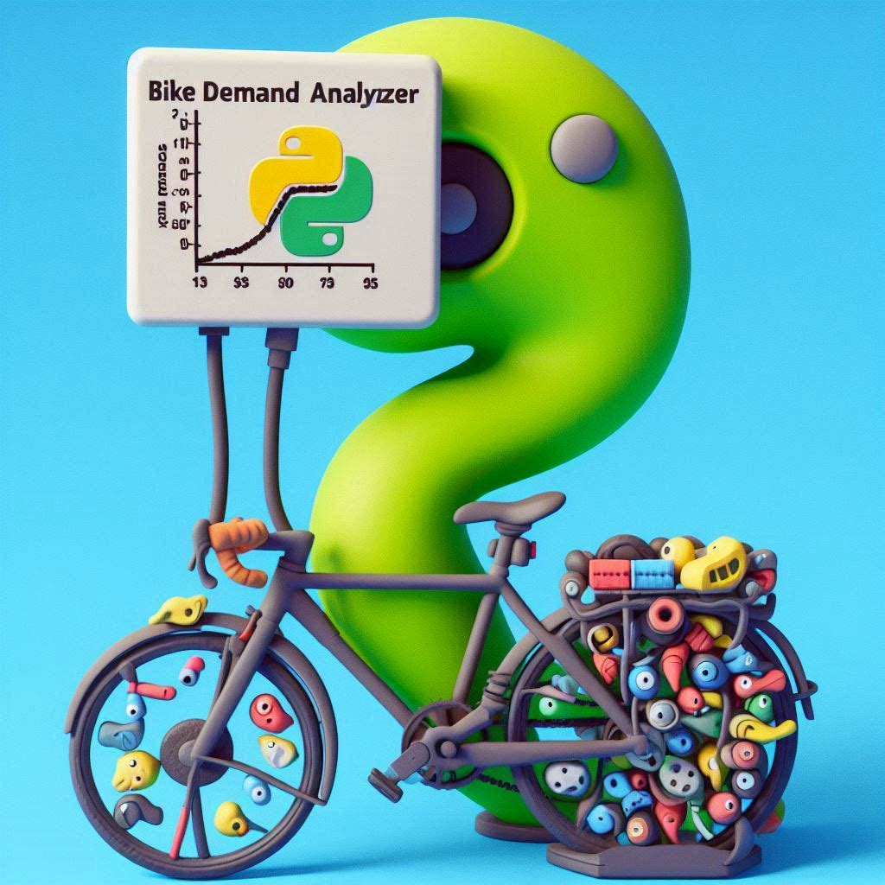
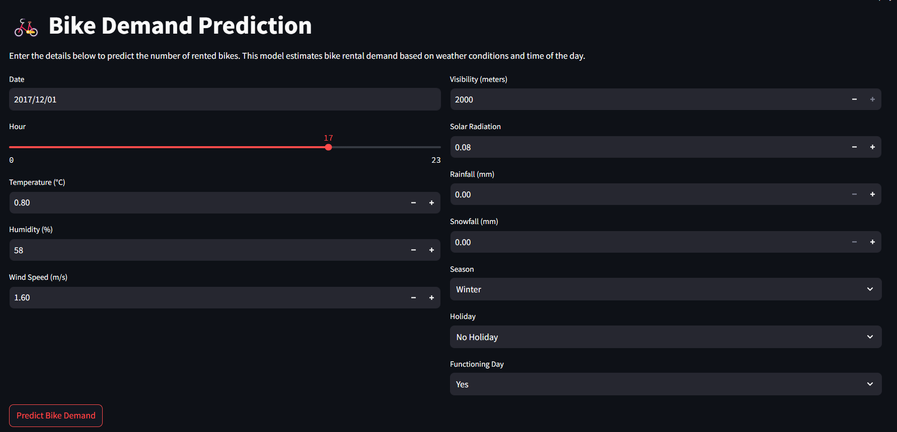
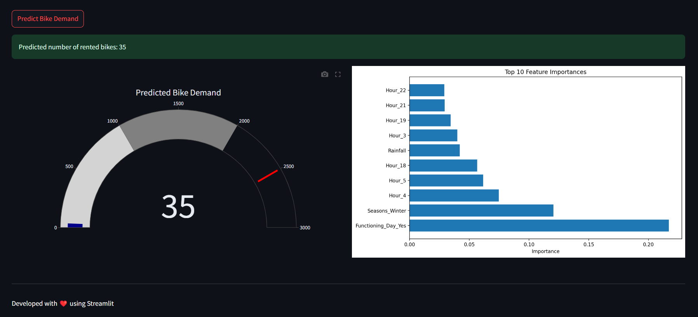

# 🚴‍♂️ Tick Tock, Pedal Clock: The Groovy Bike-Sharing Crystal Ball 🔮

<div align="center">



[🚀 Ride the Time Wave](https://pedal-clock.onrender.com) | [🔧 Tinker with the Gears](https://github.com/RamanarayanRansingh/pedal_clock_render) | [🐛 Spot a Time Glitch?](https://github.com/RamanarayanRansingh/pedal_clock_render/issues)

</div>

## 🎭 Yo, Welcome to the Bicycle Time Warp!

Strap on your helmets and prepare to pedal through the space-time continuum! **"Tick Tock, Pedal Clock"** isn't just a project, it's a groovy journey into the future of urban mobility. We're turning the chaotic world of hourly bike-sharing into a funky, well-oiled machine!

<div align="center">



</div>

## 🕵️‍♀️ The Curious Case of the Hourly Bike Boogie

Picture this: You're the DJ of urban transportation, mixing tracks of supply and demand. Your mission? Drop the perfect beat of bikes across the city, hour by hour. It's not just prediction, it's a full-on time-traveling disco!

## 🔮 Our Hourly Hocus Pocus (Now with Extra Funk!)

We've conjured up a prediction model so hip, it could probably tell you how many bikes will be doing the Cha-Cha Slide in the next hour!

### What's Groovin' in Our Crystal Ball:
- 🧠 A neural network that boogies with hourly bike-sharing patterns
- 🔍 Algorithms that can spot a demand spike faster than you can say "Stayin' Alive"
- 💡 Insights so bright, you gotta wear shades 😎

<div align="center">



</div>

## 🛠️ Our Funky Forecast Factory

1. **Data Disco**: We're spinning records of time series data like a DJ on Saturday night!
2. **Feature Funk Engineering**: Turning boring old timestamps into chart-topping hits.
3. **Model Mosh Pit**: Our algorithms are crowd-surfing through more tests than a rock star's mic check.
4. **Hyperparameter Hustle**: Fine-tuning our model with more precision than a disco ball's spin.
5. **Real-time Rave Deployment**: Predictions dropping faster than the bass at a dubstep concert!

## 📊 The "Great Scott!" Scoreboard

| Metric | Score | In Funky Speak |
|--------|-------|----------------|
| MAE | 2.04 | We're smoother than a fresh jar of Skippy! |
| RMSE | 3.15 | Our predictions? Tighter than platform shoes! |
| R² | 0.94 | We're explaining more variance than a kaleidoscope! |

## 🎭 The All-Star Prediction Lineup

Featuring the grooviest factors in our time-traveling band:
- 🌡️ Temperature (The Fahrenheit Funkateer)
- 🌞 Weather (The Atmospheric Mood Ring)
- 🕰️ Hour (The Circadian Rhythm Guitar)
- 📅 Weekday (The Seven-Day Samba)
- 🏙️ Location (The Urban Disco Ball)

## 🚀 Ready to Ride the Time Wave?

```bash
git clone https://github.com/your-username/tick-tock-pedal-clock.git
cd tick-tock-pedal-clock
python -m venv venv
source venv/bin/activate  # On Windows use `venv\Scripts\activate`
pip install -r requirements.txt
streamlit run app.py
```

Congrats! You're now the proud owner of a bike-predicting time machine. Use it wisely, or at least use it to win bets at parties!

## 📂 What's in the Time Capsule?

- `📊 data/`: More bike data than you can shake a handlebar at
- `🖼️ images/`: Eye candy that'll make your retinas dance
- `🔮 models/`: Our digital fortune tellers, now with 20% more sparkle
- `📓 notebooks/`: Where we scribble our time-bending formulas
- `⏱️ src/`: The flux capacitor of our bike-predicting DeLorean

## 🤝 Join the Time Travelers' Club

Got a idea that's so crazy it just might work? We're all ears and temporal lobes! Open an issue or send a PR our way. Let's turn this prediction game into a full-blown time carnival!

## 📜 The Not-So-Fine Print

This project is licensed under the MIT License - see the [LICENSE.md](LICENSE.md) file for details. It's like the rules of time travel, but for code!

## 🕰️ Recent Temporal Tweaks

- 🧹 Swept away some pesky time paradoxes
- 🎨 Gave our time machine a fresh coat of paint
- 🔧 Calibrated our flux capacitor for maximum accuracy
- 🚀 Launched our predictions into a parallel universe (aka production)

---

<div align="center">

Crafted with 💖, 🧠, and a dash of ⏳ by a Solo Time-Traveling Data Disco Dancer

[🐦 Tweet from the Future](https://twitter.com/yourhandle) | [💼 LinkedIn Time Capsule](www.linkedin.com/in/ramanarayanransingh) | [🐙 GitHub Time Machine](https://https://github.com/RamanarayanRansingh)

</div>

Remember: In the groovy dance of bike-sharing, your data is the disco ball that keeps the party going! 🕺💃🚲⏱️
